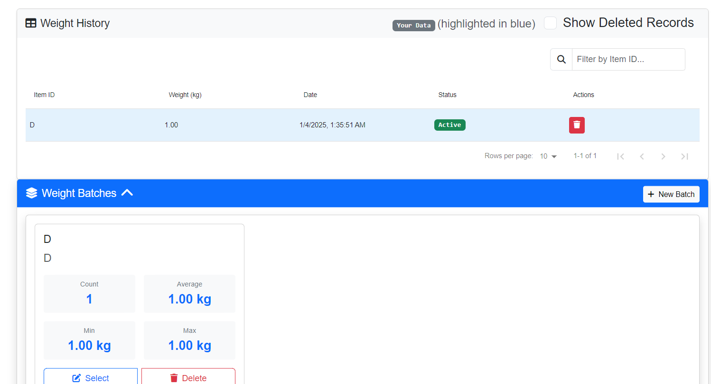

# Weight Tracker

A secure and efficient application for tracking weights on the Internet Computer, built with Rust and React.



## Features

- **Secure Authentication**: Login with Internet Identity
- **Batch Management**: Organize weights into batches
- **Real-time Updates**: Instant synchronization of weight data
- **Collaboration**: Share batches with team members
- **Data Privacy**: Full control over your data with granular sharing permissions

## Getting Started

### Prerequisites

- [DFX](https://internetcomputer.org/docs/current/developer-docs/setup/install) (>= 0.9.0)
- [Node.js](https://nodejs.org/) (>= 16)
- [Rust](https://www.rust-lang.org/tools/install) (>= 1.60)

### Local Development

1. Clone the repository:
```bash
git clone https://github.com/yourusername/weight_tracker.git
cd weight_tracker
```

2. Install dependencies:
```bash
npm install
```

3. Start the local Internet Computer replica:
```bash
dfx start --background
```

4. Deploy the canisters:
```bash
dfx deploy
```

5. Start the development server:
```bash
npm start
```

The application will be available at `http://localhost:8080`.

### Project Structure

```
weight_tracker/
├── src/
│   ├── weight_tracker_backend/     # Rust backend canister
│   │   ├── src/
│   │   │   ├── lib.rs             # Main backend logic
│   │   │   ├── models.rs          # Data models
│   │   │   ├── repositories.rs    # Data storage
│   │   │   └── traits.rs          # Interface definitions
│   │   └── Cargo.toml
│   └── weight_tracker_frontend/    # React frontend
│       ├── src/
│       │   ├── components/        # React components
│       │   ├── services/         # Backend integration
│       │   └── App.jsx           # Main application
│       └── package.json
├── dfx.json                       # DFX configuration
└── README.md
```

## Deployment

To deploy to the Internet Computer mainnet:

1. Create a cycles wallet if you haven't already:
```bash
dfx identity get-principal
dfx ledger create-canister <principal> --amount <amount>
```

2. Deploy to mainnet:
```bash
dfx deploy --network ic
```

## Development Commands

- Generate Candid interfaces:
```bash
npm run generate
```

- Run tests:
```bash
npm test
```

- Build for production:
```bash
npm run build
```

## Contributing

1. Fork the repository
2. Create your feature branch (`git checkout -b feature/AmazingFeature`)
3. Commit your changes (`git commit -m 'Add some AmazingFeature'`)
4. Push to the branch (`git push origin feature/AmazingFeature`)
5. Open a Pull Request

## License

This project is licensed under the MIT License - see the [LICENSE](LICENSE) file for details.

## Acknowledgments

- Built on the [Internet Computer](https://internetcomputer.org/)
- Frontend powered by [React](https://reactjs.org/)
- Backend written in [Rust](https://www.rust-lang.org/)

## Support

For support, please open an issue in the GitHub repository or contact the development team.
